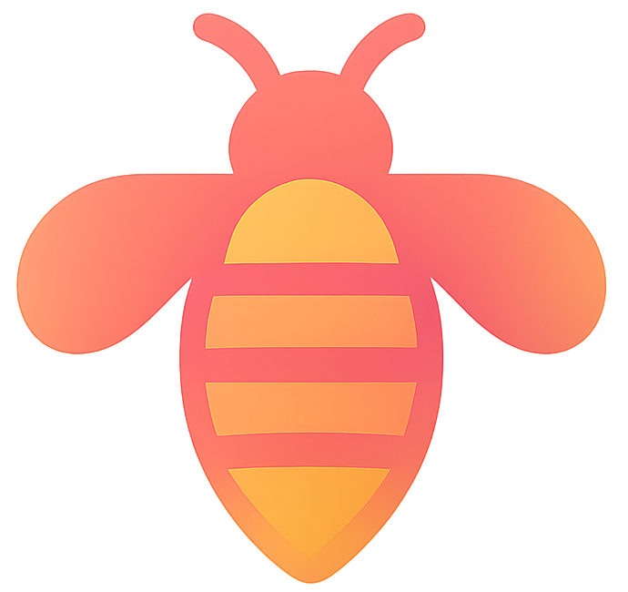

<div align="center">



# AutoDask
### AutoML Library Based on Dask with Bee Colony Optimization

[](https://www.python.org/downloads/)
[](https://opensource.org/licenses/MIT)

</div>


## 📖 Overview
AutoDask is a light AutoML library built on top of Dask for distributed computing, leveraging the Bee Colony Optimization (BCO) algorithm for hyperparameter tuning and model selection. It provides an easy-to-use interface for automated machine learning tasks while efficiently using computational resources.

## ⚡ Quickstart

**Installation** (unsupported yet)
```commandline
pip install autodask
```

**Basic Usage**
```python
from autodask.main import AutoDask

adsk = AutoDask(task='classification')
adsk.fit(X_train, y_train)
predictions = adsk.predict(X_test)
```

## 🛠️ Features

- **Automated Machine Learning:** Handles preprocessing, feature engineering, model selection, and hyperparameter tuning
- **Distributed Computing:** Leverage Dask for parallel processing and efficient resource utilization
- **Multiple ML Tasks:** Supports classification and regression tasks
- **Efficient Optimization:** Uses Bee Colony Optimization for intelligent hyperparameter tuning

## 🧩 Advanced Usage

**Custom Configuration**
```python
from autodask.main import AutoDask

# Configure with custom parameters
adsk = AutoDask(
    task='regression',
    n_jobs=-1,  # Use all available cores
    time_limit=3600,  # 1 hour time limit
    metric='r2',
    optimization_rounds=50,
    max_ensemble_models=5,
    models=['lgbm', 'xgboost', 'catboost'],  # Specify models to consider
    verbose=2
)

# Train with advanced options
adsk.fit(
    X_train, 
    y_train,
    validation_data=(X_val, y_val),
    sample_weight=weights
)
```

## 🐝 Bee Colony Optimization

AutoDask implements the Bee Colony Optimization algorithm, a nature-inspired metaheuristic based on the foraging behavior of honey bees:

- **Employed Bees**: Explore the solution space by testing different model configurations
- **Onlooker Bees**: Focus on the most promising configurations based on performance metrics
- **Scout Bees**: Prevent getting stuck in local optima by randomly exploring new configurations

This approach efficiently navigates the vast model configurations with fewer evaluations compared to traditional grid search or random search methods.

**Parameters** 
```python
from autodask.main import AutoDask

adsk = AutoDask(
    task='classification',
    bco_params={
        'employed_bees': 20,  # Number of employed bees
        'onlooker_bees': 10,  # Number of onlooker bees
        'scout_bees': 5,      # Number of scout bees
        'abandonment_limit': 10,  # Limit before abandoning a solution
        'exploration_rate': 0.3   # Balance between exploration and exploitation
    }
)
```

## Saving and Loading Models (unsupported yet)

```python
# Save the trained model
adsk.save('my_autodask_model.pkl')

# Load the model later
from autodask.main import load_model
loaded_model = load_model('my_autodask_model.pkl')
predictions = loaded_model.predict(new_data)
```

## Performance Comparison

Coming soon...

## 📧 Contact

For questions and support, please open an issue on GitHub.
